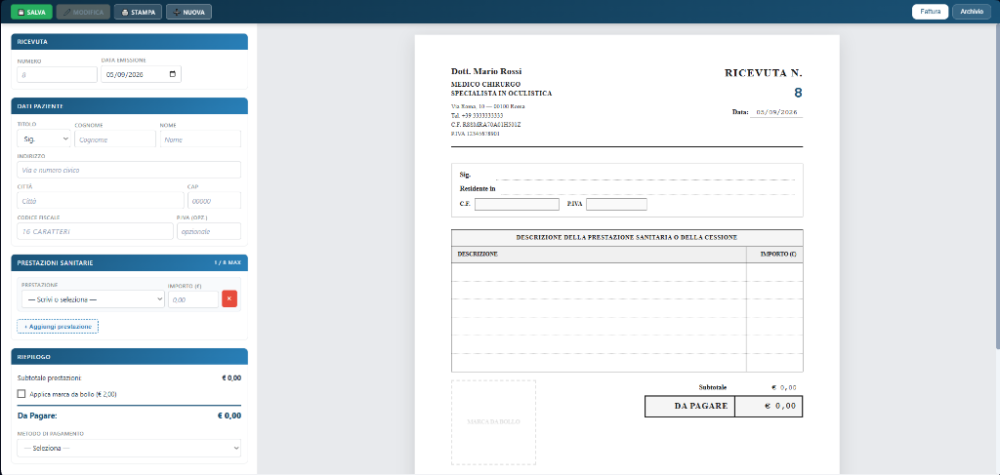
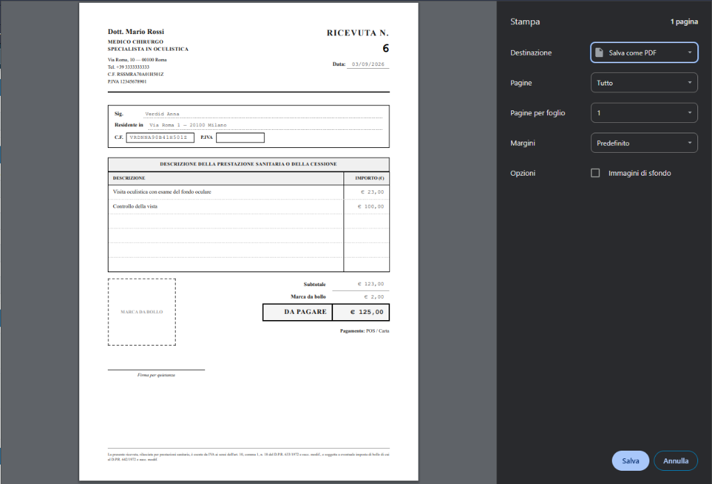
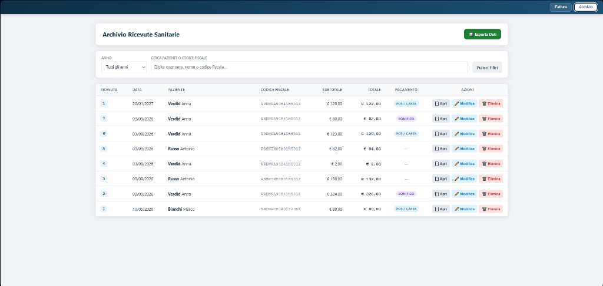
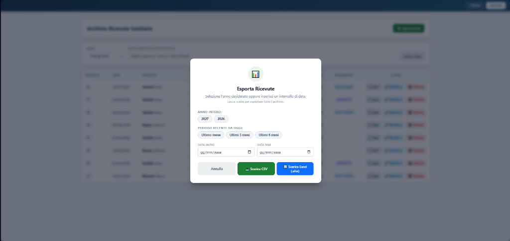

# Generatore di Ricevute e Fatture Sanitarie

Applicazione locale moderna e professionale per l'emissione, la gestione, la stampa e l'archiviazione di ricevute sanitarie con calcolo automatico della marca da bollo, gestione dei progressivi e riepilogo per la contabilità.

---

## ⚡ Riassunto delle Funzionalità Fondamentali

### 1. Compilazione Live con Anteprima Immediata e Autocompletamento CF
Compilando il modulo guidato sulla sinistra, visualizzi in tempo reale a destra il foglio A4 pronto nel layout sanitario (stile Buffetti). Digitando il Codice Fiscale di un paziente già registrato nel database, tutti i campi anagrafici (nome, cognome, indirizzo, città, CAP) si compilano all'istante in automatico.



---

### 2. Stampa 1-Click e Salvataggio PDF per Invio via Email
Con un solo clic sul pulsante **Stampa**, si apre l'anteprima di stampa del browser già ottimizzata per il foglio singolo A4. Da qui puoi stampare direttamente su carta oppure selezionare *"Salva come PDF"* per ottenere un file pulito (senza menu, barre o tasti dell'interfaccia), perfetto da inviare subito via email al paziente.



---

### 3. Archivio Ricevute Sempre Modificabile
Tutte le ricevute emesse rimangono archiviate e consultabili nella vista Archivio, con filtri immediati per anno solare e ricerca testuale per paziente o Codice Fiscale. Qualsiasi ricevuta può essere ristampata, modificata nei dati o eliminata in ogni momento, preservando l'integrità del progressivo annuale.



---

### 4. Esportazione Dati per il Commercialista (Excel e CSV)
Dall'archivio, cliccando sul pulsante **Esporta Dati**, puoi estrarre l'intero storico o filtrare per periodi specifici (anno intero, ultimi mesi o intervallo di date personalizzato). I dati possono essere scaricati sia come foglio **Excel nativo (.xlsx)** formattato con griglie e colonna valuta, sia in formato **CSV** universale.



---

## 🧭 Guida per Non Esperti: Installazione e Avvio

### 1. Scaricare il Programma da GitHub
1. In alto a destra in questa pagina GitHub, clicca sul pulsante verde **`<> Code`**.
2. Nel menu a tendina che si apre, fai clic su **`Download ZIP`**.
3. Una volta completato il download, apri il file scaricato ed **estrai l'intera cartella** sul tuo computer (ad esempio sul *Desktop* o nella cartella *Documenti*).

### 2. Prerequisito: Installare Python (se non presente)
L'applicazione ha solo bisogno di Python (gratuito e leggero) per funzionare:
1. Scarica Python dal sito ufficiale: [python.org/downloads](https://www.python.org/downloads/).
2. Avvia il file di installazione scaricato.
   > Nella prima schermata dell'installazione di Python, ricordati di mettere la spunta su **"Add python.exe to PATH"** prima di cliccare su *Install Now*.

---

### 3. Avvio su Windows

#### 🟢 Metodo Rapido (Consigliato — 1 Clic)
1. Apri la cartella del programma e fai **doppio clic sul file `avvia.bat`**.
2. **Al primo avvio**: lo script scaricherà e configurerà in automatico tutte le librerie necessarie (richiede circa 1 minuto).
3. **Dagli avvii successivi**: il server parte in 1 secondo e apre in automatico il tuo browser predefinito (**Opera, Chrome, Edge, Firefox**) all'indirizzo `http://127.0.0.1:8000`.

> [!TIP]
> **Consiglio per il Desktop**: Fai clic col tasto destro su `avvia.bat` ➔ seleziona **Invia a ➔ Desktop (crea collegamento)**. In questo modo avrai un'icona sul Desktop per far partire il programma come una normale app per PC!

#### ⚙️ Metodo Manuale (da Terminale / Utenti Esperti)
Se preferisci usare il terminale (PowerShell o CMD):
```powershell
# 1. Crea l'ambiente virtuale
python -m venv venv

# 2. Attiva l'ambiente
.\venv\Scripts\activate

# 3. Installa le dipendenze
pip install -r requirements.txt

# 4. Avvia l'applicazione
python run.py
```

---

## ✏️ Come Personalizzare Intestazione, Prestazioni e Marca da Bollo

Tutti i dati dell'intestazione e i valori predefiniti si trovano nel file **`config.json`**.  
Puoi aprirlo con **Blocco Note**, VS Code o qualsiasi editor di testo:

```json
{
  "medico": {
    "nome": "Mario",
    "cognome": "Rossi",
    "qualifica": "MEDICO CHIRURGO",
    "specializzazione": "SPECIALISTA IN OCULISTICA",
    "indirizzo": "Via Roma 10",
    "cap": "20100",
    "citta": "Milano",
    "telefono": "+39 3333333333",
    "codice_fiscale": "RSSMRA70A01H501Z",
    "partita_iva": "12345678901"
  },
  "prestazioni_frequenti": [
    "Prima visita oculistica",
    "Controllo della vista",
    "Visita oculistica con esame del fondo oculare",
    "Tonometria",
    "Esame del campo visivo"
  ],
  "bollo": {
    "soglia": 77.47,
    "importo": 2.00
  }
}
```

### 1. Modificare i Dati del Medico o Professionista
Modifica semplicemente i valori tra virgolette dentro la sezione `"medico"` inserendo il tuo nome, indirizzo studio, telefono, Codice Fiscale e Partita IVA.

### 2. Modificare le Opzioni Rapide (Prestazioni Frequenti)
La lista `"prestazioni_frequenti"` definisce le voci che compariranno nel menu di scelta rapida della ricevuta. Puoi aggiungere, togliere o rinominare le prestazioni a tuo piacimento.

### 3. Come Togliere la Marca da Bollo (per prestazioni non mediche o esenti)
Se la tua attività non richiede l'applicazione automatica della marca da bollo da 2,00 €:
- **Disattivazione automatica da configurazione**: in `config.json` imposta la soglia ad un valore irraggiungibile:
  ```json
  "bollo": {
    "soglia": 999999,
    "importo": 0.00
  }
  ```
- **Disattivazione manuale da interfaccia**: puoi sempre togliere la spunta alla casella *"Applica marca da bollo (€ 2,00)"* direttamente mentre compili la fattura.

> [!NOTE]
> Ogni modifica a `config.json` viene ricaricata automaticamente senza bisogno di riavviare il programma.

---

## 💾 Storico del Database e Backup Facile (`ricevute.db`)

Tutte le ricevute emesse, lo storico contabile e l'elenco dei pazienti registrati sono conservati all'interno di un unico file locale:
```text
ricevute.db
```

* **100% Locale e Riservato**: nessun dato viene salvato su server cloud o inviato all'esterno. Massima garanzia di tutela e riservatezza dei dati sanitari (GDPR).
* **Come fare un Backup**: ti basta copiare il file `ricevute.db` e salvarlo su una chiavetta USB, disco esterno o sul tuo cloud personale di backup.
* **Come ripristinare su un nuovo computer**: copia l'intera cartella (o scarica il progetto) sul nuovo PC e incolla il tuo file `ricevute.db` all'interno della cartella principale: ritroverai subito tutte le fatture e i pazienti intatti.

---

## 🔬 Dettagli Tecnici e Funzionalità Approfondite

<details>
<summary><strong>Clicca per visualizzare le specifiche tecniche approfondite</strong></summary>

### Gestione Numerazione e "Buchi"
* Il software calcola il progressivo annuale (`anno/numero`).
* Se una fattura intermedia viene cancellata (es. eliminata la n. 3 su 5), il sistema riassegna automaticamente il primo numero vacante disponibile al successivo inserimento, preservando l'integrità della sequenza contabile.
* È possibile specificare manualmente un numero progressivo: il sistema verifica in tempo reale eventuali duplicati e blocca collisioni per lo stesso anno solare.

### Protezione Modifiche Non Salvate
* Se stai compilando una nuova fattura o apportando modifiche a un documento esistente e premi *"➕ Nuova"*, un dialogo modale di salvaguardia ti chiede se desideri **Salvare**, **Scartare** le modifiche o **Annullare**, prevenendo perdite accidentali di lavoro.

### Dicitura Fiscale su Stampa A4
* Il piè di pagina della ricevuta include la nota di esenzione IVA ai sensi dell'art. 10, comma 1, n. 18 del D.P.R. 633/1972 e successive modificazioni, con indicazione dell'assolvimento dell'imposta di bollo.

### Esportazione Dati
* **Excel (.xlsx)**: genera file foglio di calcolo formattati in font Calibri, con allineamenti specifici, colonna importi con maschera valuta `#,##0.00 €`, righe griglia attive e salvataggio diretto con notifica percorso.
* **CSV**: generato con separatore `;` e codifica `UTF-8 con BOM` per garantire la perfetta visualizzazione di lettere accentate anche con versioni datate di software gestionali o fogli di calcolo.

### Architettura
* **Backend**: FastAPI (Python 3.10+) con SQLAlchemy 2.0 e database SQLite locale.
* **Frontend**: HTML5, Vanilla CSS (tema chiaro con supporto print media) e JavaScript moderno senza dipendenze o framework esterni pesanti.
* **Esportatore Excel**: openpyxl per generazione diretta di cartelle di lavoro `.xlsx`.

</details>

---

## ⚖️ Disclaimer e Avvertenza Legale / Fiscale

> [!WARNING]
> Questo software è fornito a solo scopo gestionale e organizzativo come supporto per la compilazione, la stampa e l'archiviazione locale delle ricevute.
> **Resta responsabilità esclusiva dell'utente verificare autonomamente che la ricevuta emessa, i dati indicati, le diciture di legge e le eventuali esenzioni fiscali rispettino pienamente tutte le normative vigenti**, nonché sottoporre e far approvare il modello di ricevuta e la relativa gestione contabile al proprio **commercialista o consulente fiscale di fiducia**.
> L'autore del software non assume alcuna responsabilità per utilizzi non conformi, errori contabili, sanzioni o adempimenti fiscali derivanti dall'impiego dell'applicazione.

---

## 📄 Licenza

Rilasciato sotto licenza MIT. Libero per uso personale e professionale.
